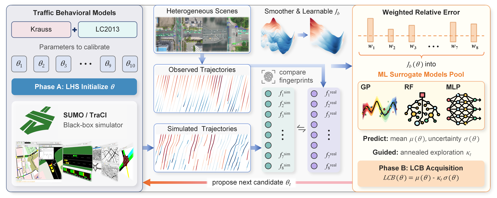

# FLAT: Fingerprint-guided Learnable Acquisition for Traffic Calibration



FLAT is a simulation-efficient calibration framework for traffic models. It
learns a behavioral fingerprint from trajectory data, uses it to define a
calibration objective, and combines a surrogate model with lower-confidence
bound acquisition under a fixed SUMO evaluation budget.

This repository contains the experiment code, public input data, cached main
comparison results, and lightweight analysis scripts for the accompanying
study.

## Repository layout

- `code/experiments/` — experiment runners and analysis scripts
- `data/` — scene configurations and public input data
- `outputs/results/` — cached summaries and released comparison results
- `assets/` — project figures used by this README

## Quick start

```bash
python -m venv .venv
# Windows: .venv\Scripts\activate
# macOS/Linux: source .venv/bin/activate
pip install -r requirements.txt
python code/experiments/analyze_significance.py
```

The significance analysis reads the cached main-comparison summary and writes
`outputs/results/comparison_scene_level_significance.csv`. It averages the
five stochastic runs within each scene and applies exact two-sided paired
Wilcoxon tests across the six scenes; it does not run SUMO.

The experiment runners under `code/experiments/` require a working SUMO/TraCI
installation. Use their command-line help for the available experiment and
scene options.

## Data

The trajectory sources used by the study are described in the experiment
configuration. Please follow the original licenses and attribution
requirements for any external dataset.

## License

Code is released under the MIT License; see [LICENSE](LICENSE).
