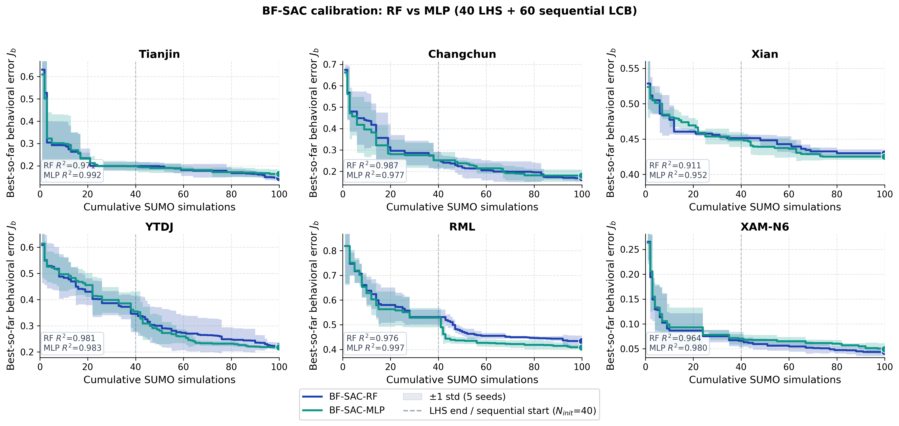
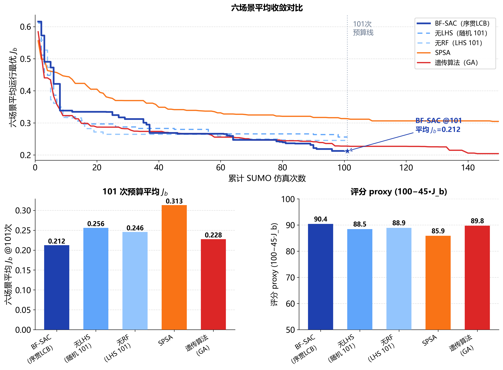
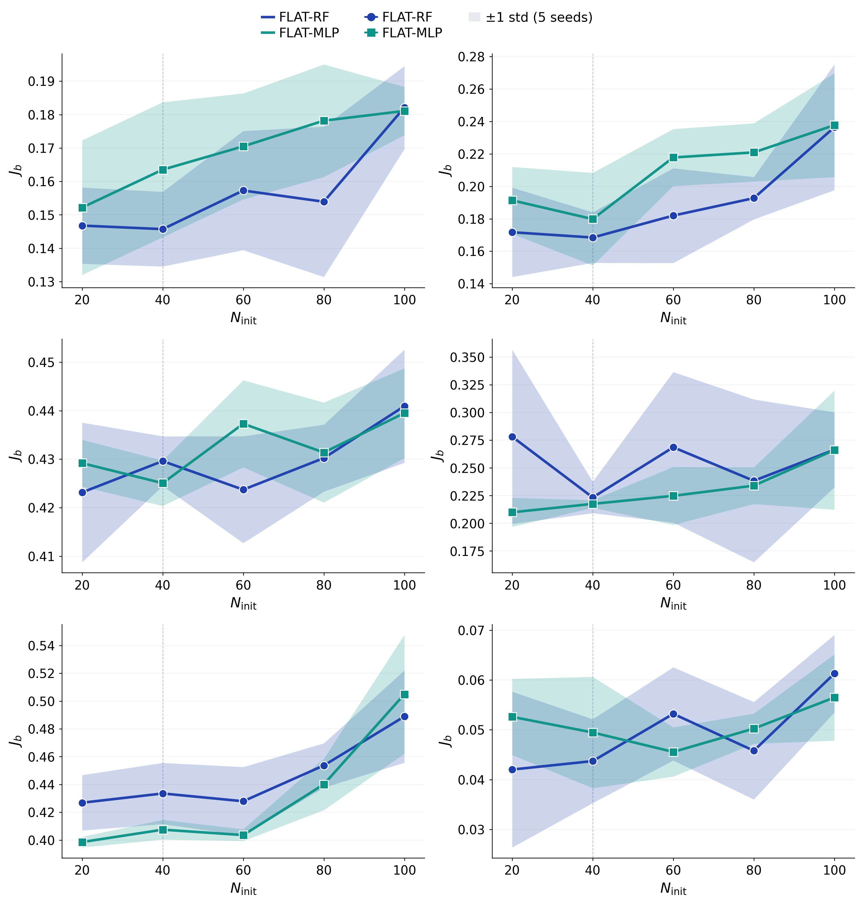
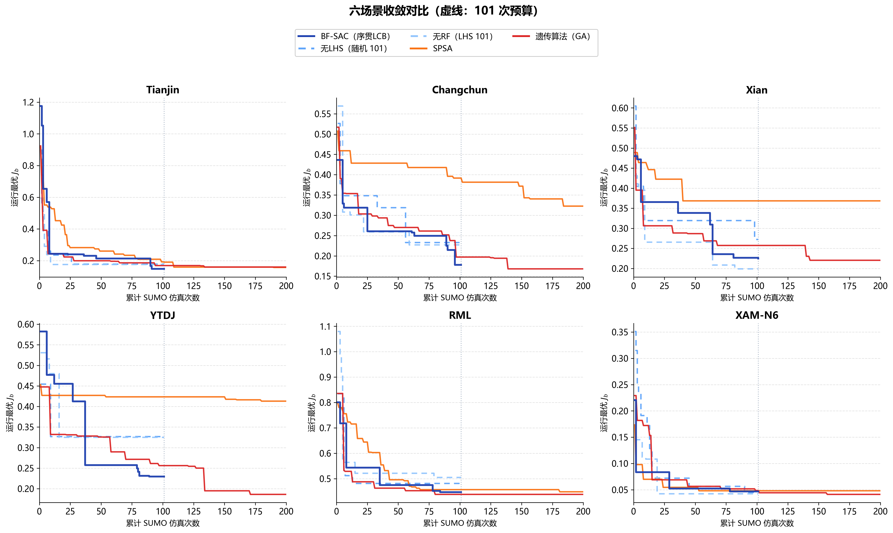

# 实验与结果分析

本文档包含 BF-SAC 实验设置、**当前仓库已提交结果**的解读，以及图表引用。复现命令见文末附录。

---

## 1. 实验设置

### 1.1 场景与数据

实验覆盖六个异构交通场景：SIND 信号交叉口（天津、长春、西安）与 UTE 城市快速路（YTDJ 合流区、RML 交织区、XAM-N6 高速合流区）。各场景由真实轨迹提取 8 维行为指纹作为标定目标，在 SUMO 数字孪生中通过 TraCI 动态改写跟驰与换道参数，每次参数评估对应一次完整仿真。

### 1.2 目标函数与公平预算

标定与对比统一最小化加权指纹误差 $J_b$：

$$
J_b(\theta_b) = \sum_{k=1}^{8} w_k \cdot \min\left(\frac{|f_k^{sim}-f_k^{real}|}{\max(|f_k^{real}|,\epsilon)}, 3\right)
$$

对比实验采用 **公平预算 100 次 SUMO**。记 `error_at_budget` 为累计仿真次数首次达到 100 时迄今为止的最小 $J_b$。所有方法总仿真次数均为 100。

实验分两层（`run_comparison.py --mode`）：

1. **主对比（`main`）**：BF-SAC-RF / BF-SAC-MLP（`n_init=40`，序贯 LCB **κ 从 2.0 线性退火至 0.5**）对四种异构基线 SPSA / GA / CMA-ES / TPE。
2. **样本效率消融（`sweep`）**：BF-SAC-RF 与 BF-SAC-MLP 在 `n_init ∈ {20,40,60,80,100}` 下扫描（总预算恒为 100；`n_init=100` 为纯 LHS，共用 100 点嵌套 LHS 设计）。

### 1.3 主对比方法（ICTAI）

| 方法                 | 机制族              | 含义                         | 仿真次数 |
| -------------------- | ------------------- | ---------------------------- | -------- |
| **BF-SAC-RF**  | 代理 / 序贯模型优化 | 40 LHS + 60 序贯 LCB（RF）   | 100      |
| **BF-SAC-MLP** | 代理 / 序贯模型优化 | 40 LHS + 60 序贯 LCB（MLP）  | 100      |
| **SPSA**       | 局部梯度估计        | 同步扰动随机逼近             | 100      |
| **GA**         | 进化 / 种群         | 种群遗传算法（10×10 波）    | 100      |
| **CMA-ES**     | 演化策略            | 协方差自适应演化策略         | 100      |
| **TPE**        | 贝叶斯密度估计      | 树结构 Parzen 估计（Optuna） | 100      |

**异构基线的选取。** 四个基线刻意覆盖不同机制族，以检验 BF-SAC 是否在“别的范式”面前都站得住：SPSA 代表局部梯度估计，GA 代表种群进化，CMA-ES 是无导数连续优化的事实标准（演化策略），TPE 则是 AutoML 领域最常用的模型类基线。需要说明的是，TPE 虽也“学习”，但建模的是好/坏配置的密度比 $p(x\mid y)$，与 BF-SAC 的回归代理 $p(y\mid x)$+采集函数是不同范式；而高斯过程贝叶斯优化与 BF-SAC 同属代理族，不计入异构基线。

**两种代理，同一套机制。** BF-SAC 的核心是“行为指纹降维 + LHS 初始设计 + 序贯 LCB 加点”，代理模型只是其中可替换的一环。序贯 LCB 为 RF 与 MLP 共用，二者的区别仅在代理本身，故方法名以代理标识即可（BF-SAC-RF / BF-SAC-MLP），无需再缀“序贯 LCB”。RF 训练轻量、对小样本稳健；MLP 为 10 成员集成，容量更高、在难拟合的响应面上更细。两者并存正是为了说明框架对代理的选择并不敏感。主对比固定 `n_init=40`，样本量的影响由 `--mode sweep` 扫描 `n_init ∈ {20,40,60,80,100}` 单独报告。

**多 seed 统计协议。** 优化重复实验使用 `--seeds`（各方法共用同一 seed 列表；BF-SAC 的 LHS/序贯/代理随机源均随 `run_seed` 变化）；cache 为 `*_b100_s{seed}.json`（seed=42 兼容无后缀）。聚合输出 `comparison_per_run.csv`、`comparison_multiseed_stats.csv`（均值 ± seed 内 std），为图 2/3 的置信带与误差棒提供数据。正式 5 次重复计划 seed：`42,101,202,303,404`。

---

## 2. BF-SAC 标定结果

### 2.1 六场景收敛与终态误差

图 1 给出六场景标定过程的运行最优 $J_b$ 收敛曲线，RF 与 MLP 两种代理并列、各为 5 seed 的均值线加 ±1 std 半透明带：前 40 次为 LHS 初始设计，竖虚线之后为序贯 LCB 加点（κ 2→0.5 退火，总预算 100）。初始阶段误差随样本累积快速下降，序贯阶段在多数场景仍能带来可见改进。两条曲线大体重合，仅在 RML、西安等较难场景上 MLP 收得更低、带更窄。



*图 1 六场景 BF-SAC 标定收敛（RF vs MLP；40 LHS + 60 序贯 LCB，κ 退火，预算 100；半透明带为 5 seed ±1 std，框内为代理拟合 $R^2$）*

标定终态指纹误差（`calibration_summary.csv`）如表 1 所示。快速路场景 XAM-N6 最低（$J_b=0.068$），交织区 RML 最高（$J_b=0.470$），说明场景几何与交通流态差异直接决定标定难度。交叉口场景内部也不齐整：天津、长春较易（0.141、0.159），西安却高达 0.427——后者饱和度高、相位切换频繁，指纹中停车占比与加减速分位的目标更难同时满足，是误差最高的交叉口。

**表 1 六场景 BF-SAC 标定终态行为指纹误差 $J_b$**

| 场景      | 类型       |         $J_b$ | RF$R^2$ | RF RMSE |
| --------- | ---------- | --------------: | --------: | ------: |
| XAM-N6    | 高速合流   | **0.068** |     0.964 |   0.021 |
| Xian      | 信号交叉口 |           0.427 |     0.911 |   0.018 |
| Tianjin   | 信号交叉口 |           0.141 |     0.971 |   0.057 |
| YTDJ      | 快速路合流 |           0.244 |     0.981 |   0.025 |
| Changchun | 信号交叉口 |           0.159 |     0.987 |   0.022 |
| RML       | 快速路交织 |           0.470 |     0.976 |   0.037 |

仅 40 个 LHS 样本即可让 RF 训练 $R^2$ 稳定在 0.94 以上，说明八维指纹已把原本崎岖的参数—误差关系压平到代理可学的程度。正是这一点让随后的 LCB 选点有据可依，而非在噪声上空转。竖虚线之后多数场景的运行最优仍在下探，XAM-N6、天津尤为明显，表明序贯阶段并非对初始设计的简单重复，而是在代理指引下持续向更优区域逼近。

### 2.2 标定参数的场景分异

标定得到的微观参数呈现清晰的环境梯度：XAM-N6 的 `speedFactor` 达 1.17、`tau` 低至 0.5 s，符合高速合流下较高的速度离散与较短跟车时距；RML 的 `tau≈2.32` s、`minGap` 较大，体现交织区保守跟驰；YTDJ 的 `accel` 上限附近（约 3.5 m/s²）与合流加减速频繁相对应。参数分异说明统一框架并未强加“一套参数走天下”，而是随场景自动收敛到可解释的局部最优。

RF 与 MLP 的逐场景对比不在此展开：两者在相同预算、相同 LHS 下并存，完整的 5 seed 结果统一放在第 3 节（表 3 与 §3.4），以免单次标定与多 seed 对比口径混淆。

---

## 3. 方法对比与消融实验

### 3.1 组合图：收敛、预算快照与评分 proxy

图 2 上方为六种方法在六个场景上的**平均**收敛曲线、下方为 @100 预算快照柱图与评分 proxy。分场景细粒度曲线见图 3。



*图 2 方法对比（x 轴止于 100；六场景算术平均；阴影为 5 seed 间 ±1 std）*

### 3.2 公平预算 100 对比（六场景平均）

**表 2 六场景平均对比（5 seed 均值，`error_at_budget` @100）**

| 方法                |     平均$J_b$ |     评分 proxy | 相对 BF-SAC-RF 误差增幅 | 100 次仿真 |
| ------------------- | --------------: | -------------: | :---------------------: | :--------: |
| **BF-SAC-RF** | **0.241** | **89.2** |           —           |    100    |
| BF-SAC-MLP          |           0.240 |           89.2 |         −0.1%         |    100    |
| TPE                 |           0.257 |           88.4 |          +6.7%          |    100    |
| 遗传算法（GA）      |           0.276 |           87.6 |         +14.7%         |    100    |
| CMA-ES              |           0.280 |           87.4 |         +16.3%         |    100    |
| SPSA                |           0.383 |           82.7 |         +59.3%         |    100    |

在相同 100 次预算、5 seed 重复下，BF-SAC（RF/MLP，0.240–0.241）**低于全部四个异构基线**：TPE 0.257、GA 0.276、CMA-ES 0.280、SPSA 0.383。这一结果跨越了梯度估计、种群进化、演化策略、贝叶斯密度四种不同范式，说明优势来自方法本身，而非与某一类算法的偶然契合。图 2 柱图含 seed 内 std 误差棒，分场景数值见表 3，多 seed 统计另存 `comparison_multiseed_stats.csv`。

**跨场景配对显著性（Wilcoxon）。** 在每个 seed 内，将六个场景的 `error_at_budget` 视为配对观测，对 BF-SAC-RF 与各基线做单侧 Wilcoxon 符号秩检验（BF-SAC 更小更好；`analyze_significance.py`）。结果见 `comparison_significance.csv`：

| 基线 | 中位 *p* | *p* 范围 | 显著 seed 数（*p*<0.05） | 平均领先场景数 / 6 |
| ---- | -------: | -------: | :---------------------: | :-----------------: |
| SPSA | 0.016 | [0.016, 0.078] | **4 / 5** | 5.6 |
| CMA-ES | 0.047 | [0.016, 0.422] | 3 / 5 | 4.8 |
| GA | 0.047 | [0.016, 0.422] | 3 / 5 | 4.8 |
| TPE | 0.156 | [0.047, 0.578] | 1 / 5 | 4.0 |

解读与表 3 一致：**SPSA、GA、CMA-ES 上 BF-SAC-RF 在多数 seed 的六场景整体上显著更优**（平均 4.8–5.6 个场景领先）。相对 **TPE** 则更接近：仅 1/5 seed 达到 *p*<0.05，但五次重复中平均仍有 4/6 场景领先，与长春平局、西安「平底」等胶着场景一致——整体仍优，但不宜表述为「对 TPE 全面显著碾压」。检验功效受六场景样本量限制，故与均值表、分场景表并列阅读，而非替代机理分析。

基线的次序本身就有信息量。**TPE 是最强对手**——它同为模型类方法，靠密度比快速锁定有希望的区域，却仍落后约 7%，差距正落在 BF-SAC 的两处优势上：领域指纹把目标压得更平滑，回归代理 + LCB 比逐维密度估计更善于利用参数间的耦合。**CMA-ES 在百次预算内偏弱**（0.280），印证了演化策略“样本饥渴”的本性：10 维下种群约 10、仅够跑十代，协方差还没自适应到位预算就用尽了。**SPSA 垫底**且方差大，其总平均被长春（0.603）这类失稳结果拖高。可见 BF-SAC 的领先不靠某一两个场景的极端值，而是在六个场景上一致靠前。

### 3.3 分场景要点

**表 3 各场景 5 seed 均值 $J_b$（越小越好，加粗为最优；括号内为 seed 内 std）**

| 场景      |        BF-SAC-RF        |       BF-SAC-MLP       |           TPE           |      GA      |    CMA-ES    |     SPSA     |
| --------- | :---------------------: | :---------------------: | :---------------------: | :-----------: | :-----------: | :-----------: |
| XAM-N6    | **0.044** (0.008) |      0.049 (0.011)      |      0.047 (0.008)      | 0.045 (0.006) | 0.062 (0.013) | 0.162 (0.114) |
| Xian      |      0.430 (0.005)      | **0.425** (0.005) |      0.426 (0.013)      | 0.440 (0.020) | 0.435 (0.008) | 0.440 (0.003) |
| Tianjin   | **0.146** (0.011) |      0.164 (0.020)      |      0.165 (0.010)      | 0.170 (0.013) | 0.170 (0.016) | 0.192 (0.054) |
| YTDJ      |      0.223 (0.014)      | **0.218** (0.003) |      0.284 (0.067)      | 0.313 (0.040) | 0.280 (0.058) | 0.365 (0.092) |
| Changchun |      0.168 (0.016)      |      0.180 (0.029)      | **0.167** (0.013) | 0.225 (0.050) | 0.293 (0.109) | 0.603 (0.097) |
| RML       |      0.434 (0.022)      | **0.408** (0.007) |      0.452 (0.008)      | 0.464 (0.048) | 0.440 (0.017) | 0.540 (0.129) |

BF-SAC（RF 或 MLP）在六场景中**五个取得最优**，唯一例外是长春——TPE 以 0.167 对 BF-SAC-RF 0.168 险胜，差距远在彼此 std 之内，实为平局。换言之，没有任何异构基线能在哪个场景上明显压过 BF-SAC。

分场景的差距大小，则由目标景观的形态决定。西安是典型的“平底”场景，六种方法的 $J_b$ 都压在 0.43 附近、相差不足 0.02——误差主要来自指纹与参数空间的固有失配，留给优化的余地本就有限，连 SPSA 也不落下风。长春、RML 等崎岖场景则把方法间差距拉开：SPSA 两点梯度易陷局部陷阱，CMA-ES 在百次预算内来不及自适应（长春 0.293、方差大），而代理凭借对全局曲面的平滑拟合稳定胜出。XAM-N6 误差最低（RF 0.044），GA、TPE 几乎追平（0.045、0.047），说明当最优区域宽阔易达时，各路方法殊途同归。可见 BF-SAC 的价值，集中在那些中等崎岖、需要“看准方向再落子”的场景。

### 3.4 N_init 样本效率消融（sweep）



*图 4 RF/MLP 在 `n_init ∈ {20,40,60,80,100}` 下的终态 $J_b$（总预算 100；各点 5 seed 均值，半透明带 ±1 std；`n_init=100` 为纯 LHS）*

五个 `n_init` 档位补齐到 5 seed 后，消融给出了比主对比更干净的因果证据。最稳健的一条规律是：总预算锁定为 100 时，纯 LHS（`n_init=100`、无序贯）在几乎所有场景上都是最差或接近最差的配置——长春由 0.168 抬到 0.236，天津由 0.146 抬到 0.182，RML 的 MLP 由 0.399 抬到 0.505。这直接表明，把后半程预算交给代理引导的 LCB 选点，远比继续做空间填充划算；序贯机制的增益是真实的，而非初始设计的副产品。其次，最优 `n_init` 普遍落在偏小的 20–40 区间，意味着代理只需少量样本即可“上手”，此后每一次仿真都应尽量用于定向加点，而不是扩充初始库。`n_init=40` 恰处“代理已可靠、又给序贯留足 60 步”的平衡点，这也是主对比取此值的原因。

**代理怎么选，由场景的拟合难度决定。** 把六场景按可达误差排序，规律相当清晰。三个“易拟合”场景——XAM-N6（$J_b$≈0.044）、天津（0.146）、长春（0.168），RF 训练 $R^2$ 已在 0.96–0.99——RF 与 MLP 打平甚至 RF 略优，MLP 的额外容量无处发力。三个“难拟合”场景里，MLP 的优势随拟合难度上升而显现：西安响应面最崎岖，RF 仅能拟合到 $R^2$=0.911，换 MLP 升到 0.952；RML 由 0.976 升到 0.997，终态 $J_b$ 也从 0.434 明显降到 0.408（约 6%）。换言之，MLP 的高容量只在 RF 力有不逮、响应面复杂时才兑现为更低误差。方差视角给出同一结论：RF 轻量但对初始设计敏感（YTDJ `n_init=20` 时 std 达 0.079），MLP 以集成平均换取一致（同档 0.013）。因此把 RF 当轻量默认、MLP 留给最难场景，比“两者通用互补”更贴合数据。

---

## 4. 六场景多方法收敛

图 3 将各方法在六个场景上的运行最优 $J_b$ 收敛并列展示，虚线标示 100 次公平预算。



*图 3 六场景 × 多方法收敛对比（虚线：100 次预算；半透明带为 5 seed 间 ±1 std）*

图中三条信息值得留意。其一，预算对齐后各方法横轴统一止于 100，纵向可比；曲线为 5 seed 聚合的均值线加 ±1 std 半透明带，带的宽窄直接反映稳定性——BF-SAC 的带最窄，SPSA、CMA-ES 在长春等场景明显发散。其二，BF-SAC 与 TPE 的下降都集中在前段，但 BF-SAC 越过 40 次竖线进入序贯段后仍能缓慢精炼，终点更低；CMA-ES 早期下降偏慢，呼应其样本饥渴的本性。其三，SPSA 在相同次数内始终位于上方，带越到后期越宽，说明预算耗尽时仍未收敛。

---

## 5. 综合讨论

**核心机理：把预算花在刀刃上。** 单次评估即需一次完整仿真，决定成败的不是用了多少次仿真，而是每一次花在何处。消融实验最有力地印证了这一点：总预算同为 100，纯 LHS 在所有场景都不如“40 次铺底 + 60 次 LCB 加点”。八维行为指纹先把崎岖的参数—误差关系压平到代理可学的程度，代理再把后半程的仿真定向投放到最有希望的区域——领域特征化与序贯决策的耦合，正是样本效率的来源。

**框架对代理不敏感，RF 可作默认。** 5 seed 后 RF 与 MLP 六场景平均几乎重合（0.241 与 0.240），逐场景看也大多落在彼此 ±1 std 之内——真正可判定的差异只有 RML（MLP 0.408 对 RF 0.434）。这说明二者更像“同一机制下可互换的代理”，而非各占半壁的互补方法。其中仍有一条可解释的弱趋势：MLP 的高容量只在响应面崎岖、RF 拟合不足的难场景（RML、西安）兑现增益，易场景上则无差别甚至略逊。据此，RF 因轻量稳健宜作默认，MLP 在最难场景作备选；框架的价值恰在于不依赖某一种代理。

**跨四种范式都领先，差距首先来自稳健性。** 把基线扩到四个机制族后，结论更硬气：BF-SAC 在六场景平均上同时胜过 SPSA、GA、CMA-ES、TPE，优势不是与某类算法的偶然契合。其中 TPE 最接近（+6.7%），它同为模型类、收敛快，但逐维密度估计不如回归代理 + LCB 善用参数耦合；CMA-ES 在百次预算内还没“热身”够（+16.3%），暴露演化策略的样本饥渴；SPSA 因梯度失稳垫底。各基线性质不同——GA、CMA-ES 不至崩溃但收敛慢，SPSA 在崎岖场景直接失稳——但都败在同一处：把宝贵的仿真花在了盲目试探上。BF-SAC 的优势因而应理解为预算内的稳健最优，而非平均精度的微弱领先。

**场景存在不可约的下界，评价需有节制。** 西安四法同处 0.43 附近、序贯几乎无增益，说明该场景误差主要源于指纹与参数空间的固有失配，已逼近当前建模能力的下界。这类场景的存在意味着标定质量的上限部分由问题本身决定；脱离场景难度谈绝对精度，容易高估或低估方法的真实贡献。

**图表与数据文件。** 上述分析基于：`comparison_summary.csv`（180 行主对比：6 方法 × 6 场景 × 5 seed）、`comparison_multiseed_stats.csv`、`comparison_significance.csv`、`comparison_summary_sweep.csv` 及 `comparison_cache/`。本地重新作图（输出 PNG + PDF + SVG）：

```bash
python code/experiments/plot_all_figures.py
```

---

## 附录：复现

目标函数 $J_b$ 定义见 §1.2，每次评估对应一次 SUMO–TraCI 仿真。完整的环境配置、实验矩阵与规模、一键运行脚本与作图命令见 [REPRODUCE.md](REPRODUCE.md)，数据准备见 [DATA.md](DATA.md)。
